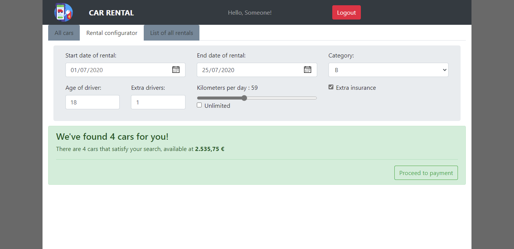

# Car Rental Web App

## Instruction

Run:

    cd server; npm install; nodemon
  
After the server has loaded, on another terminal run:

    cd client; npm install; npm start

## React client application routes

- Route `/` (and all non-matching routes):  will redirect to `/cars`
- Route `/cars`: main page that shows all the cars, that can filter by category and brand
- Route `/login`: login page (together with `/`, is the only one accisible to non logged users)
- Route `/config`: configurator page
- Route `/config/payment`: page that manages the payment. If no selection has been performed, it will redirect to `/config`.
- Route `/rentals`: page that provides all the rentals performed by the logged user


## REST API server

All the REST APIs will begin with `/api` (omitted in the following part)


### "Public" APIs (accessible without authentication token)

- GET `/cars` 
  - no request body and parameters
  - response with the full car set
- GET `/brands`
  - no request body and parameters
  - response with all brands
- POST `/login`
  - request body with username and password
  - if successful will set the cookie and return the username
- GET `/login`
  - no request body and parameters, it is used to check whether the user is logged in or not
  - if user is already  logged in, it will return the username

### "Private" APIs (accessible only with authentication token)

- GET `/logout`
  - no request body and parameters
  - empty response, only clears the cookie
- GET `/configuration` 
  - request URL contains the requested configuration parameters as in the example:
`/configuration?start=2020-06-22&end=2020-06-22&category=A&kilometer=0&unlimited=true&age=18&extra_drivers=0&insurance=false`
  - response body contains the available cars
- GET `/rentals?ended=true|false` 
  - no request body, params indicates whether the requested rentals are the future ones or the historical ones
  - response body contains the list of rentals matching the search for the logged user
- POST `/pay`
  - request body contains credit card and amount to pay
  - response body with fake payment code number in case of good request
- POST `/rentals` 
  - request body with rental configuration, accepted price and payment receipt info, in body, as in the example that follows
-  response with empty body (status code is meaningful)
```
{
  configuration: {
    start: '2020-07-04',
    end: '2020-07-16',
    category: 'C',
    kilometer: '46',
    unlimited: false,
    age: 18,
    extra_drivers: 0,
    insurance: false
  },
  amount: 778.05,
  receipt: 220999
}
```
 
- DELETE `/rentals/:id`
  - no request body, only GET parameters indicating the id of the rental to delete
  - no response body (status code is meaningful)

## Server database

- Table `cars` - contains data about car rental's car:
 >cars(	__id__ , category, brand, model)
- Table `users` - contains infos about registered users:
 > users(__id__, username, email,  password)
- Table `rentals` - contains info about rentals:
 > rentals(__id__, car_id, user_id, start_day, end_day, driver_age, extra_drivers, extra_insurance, kilometer, unlimited_km, price )


## Main React Components

- `App` (in `App.js`): main React component, it will manage all the other components, making them rendering according to the routes
  - `Header` (in `Header.js`): manages the top part of the page, with buttons to log-in/out. When the user is logged in, it renders also the `NavigationPanel` for the navigation between pages (2 different instantiation of this component are created, one to be shown in desktop mode and one in mobile, with different classes and properties ).
  - `CarList` (in `CarList.js`): it manages the rendering of `/cars` route and the state of all categories, brands and the selected ones. Uses:
    - `CarFilterBox` (in `CarFilters.js`): manages the filter part. Uses `CarFilterItem`, declared in the same file
    - `CarTable` (in `CarTable.js`): manages all the cars and renders them according to the filters. Uses `SmartTable` (`SmartTable.js`) to render the list (provides pagination and sorting by columns).
  - `Login` (in `Login.js`): manage the rendering of the `/login` page, using:
    - `LoginForm` (in `Login.js`): manages the rendering of the login form, its state and submission
  -  `Configurator` (in `Configurator.js`): page that manages the configuration, the credit card infos, the availabillity of cars and their rendering. It is always mounted so that the navigation through the pages keeps the configuration that has being performed. Uses:
      - `ConfigurationForm` (in `ConfigurationForm.js`): manages all the rendering of form for the configuration
      -  `AvailableCar` (in `ConfiguratorForm.js`): renders the messages after a search
      - `PaymentDialog` (in `Payment.js`): renders the modal for the payment. Uses `PaymentForm` from the same file to render the form and the example credit card
  - `Rentals` (in `Rentals.js`): manages rendering and states of `/rentals` route. If no rental is present, just print a message. Uses:
     - `RentalTable` (in `RentalTable.js`) [generated twice by `Rentals`, one for past rentals and one for the future/current ones]: renders the header message and the table of rentals (using `SmartTable`), only if there are rentals in that "category"

## Screenshot





## Test users

* sample@gmail.com, "password" (frequent customer)
* admin@gmail.com, "admin"
* someone@gmail.com, "password1"
* gmail@gmail.com, "password"
* email@gmail.com, "password2" 

In the date of 2020-08-15 there are less then 10% cars of category C available (1 over 12)
